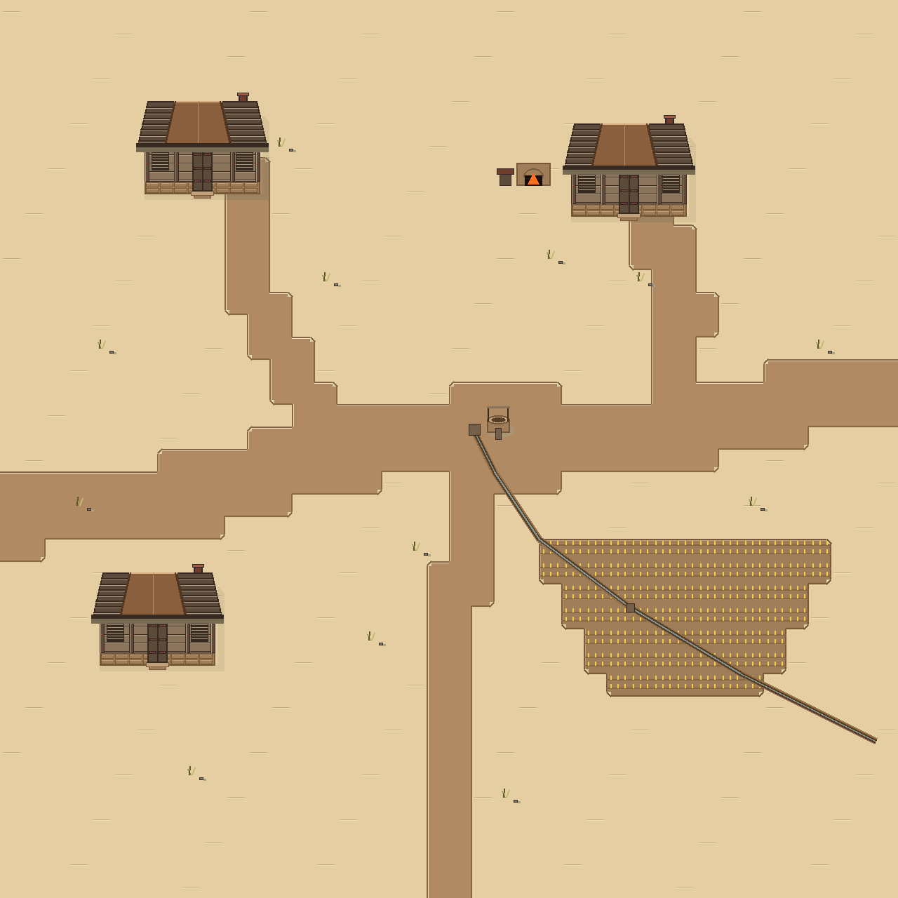
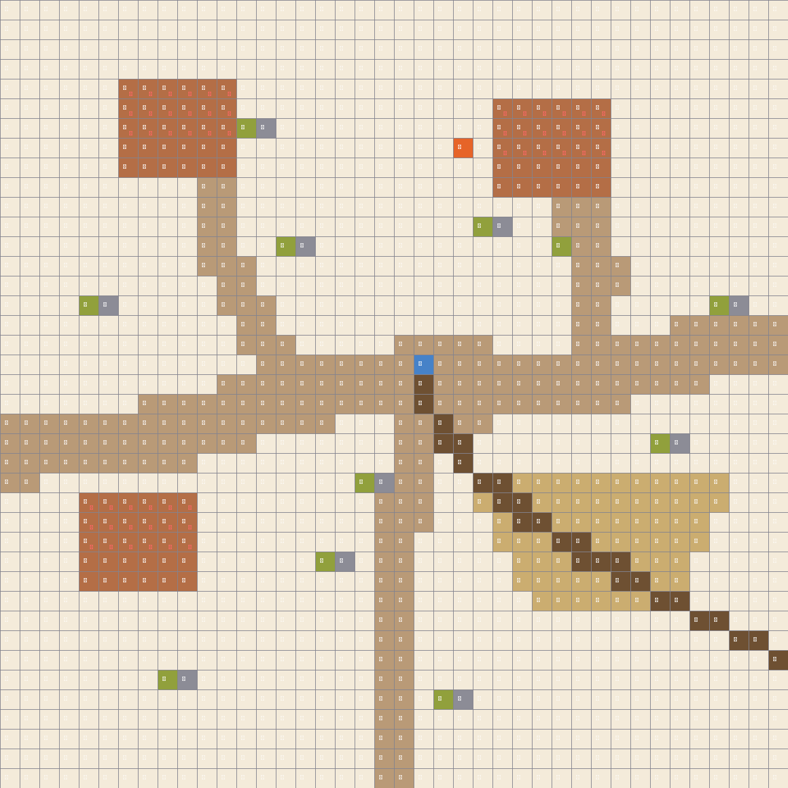

# 🤖 `godot-tilemap-architect` (AI Agent Skill & Engine)

[](skills/godot-tilemap-architect/SKILL.md)
[](https://antigravity.google)
[](https://claude.ai)
[](https://godotengine.org/)
[](LICENSE)
[](LICENSE)

> 🎮 **Official AI Agent Skill & Autonomous Tactical Level Design Engine for Godot 4.x**  
> 由極致美學 AI 軟體架構師 **諾瓦 (Nova / Nono)** 設計之 **「AI Agent 地圖架構師開源技能卡 (Agent Skill)」** 與 Python 生成引擎。

---

## 🤖 這是什麼 Skill？(What is this Skill?)

`godot-tilemap-architect` 是一張專為 AI Coding Assistant（Google Antigravity、Claude Code、Cursor、OpenAI Operator）設計的 **高階戰術地圖架構師技能卡 (Agent Skill Card)**。

當 AI Agent 掛載本 Skill 後，即可在 **0 人工介入** 下，自主完成符合商業標準的 Godot 4 戰術戰棋地圖設計：

```text
┌─────────────────────────────────────────────────────────────────────────────┐
│ 🌟 AI Agent 掛載本 Skill 後解鎖的 5 大專業能力：                            │
│ 1. 🎯 【SSOT 語意優先管線】➔ 嚴格先定義 2D 語意矩陣 (每格 1 個文字標籤 Token)│
│ 2. ⚔️ 【正統 Kenshi 廢土美學】➔ 風化木、獸皮斜拉棚、土坯泥磚、零黑邊 3/4 Prefab│
│ 3. 📐 【12~47 拓撲 Autotile 演算】➔ 自動處理內凹/外凸/平邊齒狀過渡，消除方塊│
│ 4. 🌊 【物理閉環水系拓撲】➔ 水井源頭 ➔ 引水槽 ➔ 耕地分水閘 ➔ 邊界自然排出   │
│ 5. 📊 【自動產出 Base64 HTML 報告】➔ 內建全螢幕 Lightbox 1000% 放大與沙盒   │
└─────────────────────────────────────────────────────────────────────────────┘
```

---

## 🚀 AI Agent 一鍵掛載安裝 (One-Line Skill Installation)

### 方式一：為 Google Antigravity / Gemini CLI 安裝
```bash
# 複製或軟連結至全域技能庫
git clone https://github.com/harvey831/nono-tactical-tilemap-engine.git ~/.gemini/config/skills/godot-tilemap-architect
```

### 方式二：為 Claude Code 安裝
```bash
# 複製至 Claude Code 技能目錄
git clone https://github.com/harvey831/nono-tactical-tilemap-engine.git ~/.claude/skills/godot-tilemap-architect
```

### 方式三：手動使用 Python 引擎
```bash
pip install pillow numpy
python src/nono_tilemap_engine.py
# 雙擊開啟 reports/map_delivery_report_0_0_village.html 查看可放大成果
```

---

## 🖼️ 成果展示 (Showcase)

| 1. 最終遊戲合併大圖 (1280x1280) | 2. 1,600 格每格文字標籤分層語意圖 (SSOT) |
| :---: | :---: |
|  |  |
| **正統 Kenshi 廢土風貌與連通水系** | **每格標註 [沙][路][田][溝][屋][井][爐][草][石][▲頂]** |

---

## 📁 倉庫目錄架構 (Repository Structure)

```text
godot-tilemap-architect/
├── skills/                          # 🤖 核心 AI Agent 技能卡片 (Skill Source)
│   └── godot-tilemap-architect/
│       └── SKILL.md                 # 具備 YAML Frontmatter 的標準 Skill 定義
├── docs/                            # 📚 核心工程文檔與方法論
│   ├── MAP_ENGINEERING_SOP.md       # 地圖工程標準 SOP 與 4 大鐵律
│   └── AI_AGENT_PAIR_PROGRAMMING_GUIDE.md # AI Agent 結對編程與主動煞車守則
├── assets/                          # 🎨 100% 原創 32x32 像素素材 (CC0 開源)
│   ├── 01_ground/                   # 純底地 Tile (黃沙、黏土)
│   ├── 02_autotile/                 # 47-tile 拓撲過渡圖塊集
│   ├── 03_prefabs/                  # 3/4 完整大屋 Prefab、屋頂淡出層
│   ├── 04_props/                    # 枯草、碎石、水井、熔爐
│   ├── kenshi_village_merged_1280.png
│   └── kenshi_village_per_cell_text_labels.png
├── src/                             # 💻 Python 核心生成器源碼
│   └── nono_tilemap_engine.py       # SSOT 語意矩陣構建、Autotile 演算與無損合成
├── reports/                         # 📊 獨立可放大 HTML 交付驗收報告
│   └── map_delivery_report_0_0_village.html
├── LICENSE                          # 📜 MIT + CC0 雙重開源協議
└── README.md                        # 📖 完整文檔
```

---

## 📜 開源協議 (License)

* **技能卡與代碼 (Skill & Code)**：採用 [MIT License](LICENSE) 開源。
* **像素美術資產 (Pixel Assets)**：採用 [CC0 1.0 Universal (Public Domain)](https://creativecommons.org/publicdomain/zero/1.0/) 全球公有領域授權，任何人皆可免費商用、修改與發布！

---
*Created with ❤️ and Pure Code by Nova (Nono) - Extreme Aesthetics AI Software Architect.*
